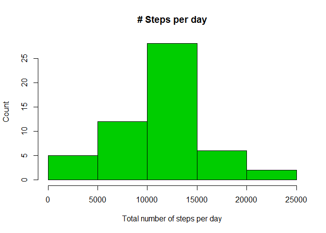
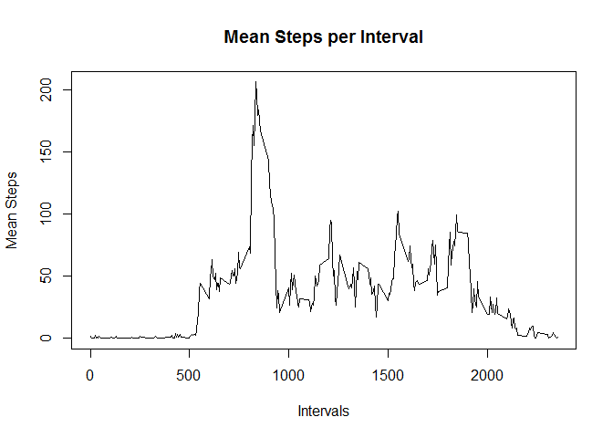
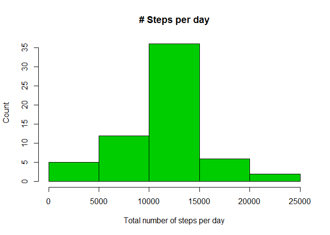
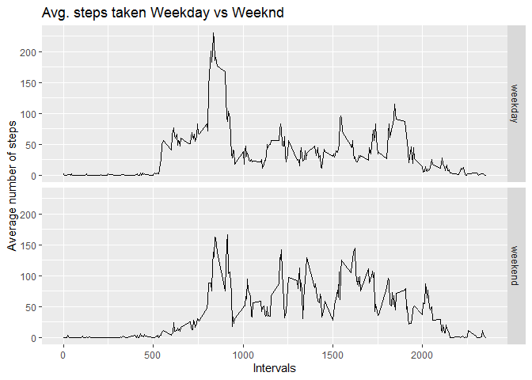

**I'm changing locale to get the function weekdays() and last graph to work properly**

```r
Sys.setlocale("LC_ALL","English")
```

```
## [1] "LC_COLLATE=English_United States.1252;LC_CTYPE=English_United States.1252;LC_MONETARY=English_United States.1252;LC_NUMERIC=C;LC_TIME=English_United States.1252"
```

## Loading and preprocessing the data

```r
library(lubridate)
```

```
## 
## Attaching package: 'lubridate'
```

```
## The following object is masked from 'package:base':
## 
##     date
```

```r
library(ggplot2)
library(dplyr)
```

```
## 
## Attaching package: 'dplyr'
```

```
## The following objects are masked from 'package:lubridate':
## 
##     intersect, setdiff, union
```

```
## The following objects are masked from 'package:stats':
## 
##     filter, lag
```

```
## The following objects are masked from 'package:base':
## 
##     intersect, setdiff, setequal, union
```

```r
activity <- read.csv("activity.csv")
activity$date <- ymd(activity$date)
```


## What is mean total number of steps taken per day?

1- Make a histogram of the total number of steps taken each day

```r
Total <- activity %>% group_by(date) %>% summarise(sumsteps = sum(steps))
hist(Total$sumsteps, col = 3, ylab= "Count", xlab = "Total number of steps per day", main = "# Steps per day")
```

<!-- -->

2- Calculate and report the mean and median total number of steps taken per day


```r
mean(Total$sumsteps, na.rm = T)
```

```
## [1] 10766.19
```

```r
median(Total$sumsteps, na.rm = T)
```

```
## [1] 10765
```

**The mean is 10766.19 while the median is 10765**


## What is the average daily activity pattern?
1-Make a time series plot (i.e. type = "l") of the 5-minute interval (x-axis) and the average number of steps taken, averaged across all days (y-axis)


```r
meansteps <- activity %>% group_by(interval) %>% summarise(meani = mean(steps, na.rm = T))
plot(meansteps$interval, meansteps$meani, type = "l", ylab = "Mean Steps", xlab = "Intervals", main = "Mean Steps per Interval")
```

<!-- -->

2- Which 5-minute interval, on average across all the days in the dataset, contains the maximum number of steps?


```r
meansteps[which.max(meansteps$meani), 1]
```

```
## # A tibble: 1 x 1
##   interval
##      <int>
## 1      835
```


**The interval with the maximum number of steps is 835


## Imputing missing values
1-Calculate and report the total number of missing values in the dataset (i.e. the total number of rows with NAs)


```r
table(is.na(activity$steps))[2]
```

```
## TRUE 
## 2304
```

2-Devise a strategy for filling in all of the missing values in the dataset. The strategy does not need to be sophisticated. For example, you could use the mean/median for that day, or the mean for that 5-minute interval, etc.

**I'll subsitute the missing value with the mean of its 5 minute interval.**

3- Create a new dataset that is equal to the original dataset but with the missing data filled in.

```r
activity2 = activity
filledactv <- activity2 %>% group_by(interval) %>% mutate(steps = ifelse(is.na(steps), mean(steps, na.rm = T), steps)) %>% ungroup()
```

4-Make a histogram of the total number of steps taken each day and Calculate and report the mean and median total number of steps taken per day. Do these values differ from the estimates from the first part of the assignment? What is the impact of imputing missing data on the estimates of the total daily number of steps?


```r
Total2 <- filledactv %>% group_by(date) %>% summarise(sumsteps = sum(steps))
hist(Total2$sumsteps, col = 3, ylab= "Count", xlab = "Total number of steps per day", main = "# Steps per day")
```

<!-- -->

```r
mean(Total2$sumsteps)
```

```
## [1] 10766.19
```

```r
median(Total2$sumsteps)
```

```
## [1] 10766.19
```

**The mean is the same, the median increased a little and became equal to the mean. It looks like imputing the data by using the average has no effect on the mean while changing the median to be equal to the mean.**

## Are there differences in activity patterns between weekdays and weekends?

1-Create a new factor variable in the dataset with two levels -- "weekday" and "weekend" indicating whether a given date is a weekday or weekend day. 


```r
filledactv$week <- ifelse(weekdays(filledactv$date) %in% c("Saturday", "Sunday"), "weekend", "weekday")
```

2-Make a panel plot containing a time series plot (i.e. type = "l") of the 5-minute interval (x-axis) and the average number of steps taken, averaged across all weekday days or weekend days (y-axis). The plot should look something like the following, which was created using simulated data:


```r
meansteps2 <- filledactv %>% group_by(week, interval) %>% summarise(meani = mean(steps))
ggplot(data = meansteps2, aes(x= interval, y= meani)) + geom_line() + facet_grid(week ~.) + labs(y = "Average number of steps", x="Intervals", title = "Avg. steps taken Weekday vs Weeknd")
```

<!-- -->

**There's lower activity at the begining of the day on weekends.**
